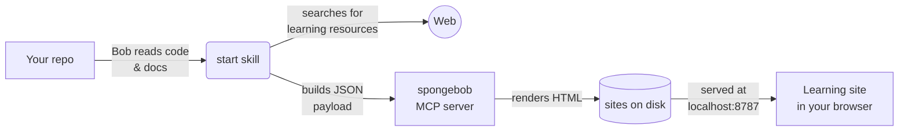

# spongebob

> *Here to help you **absorb** any repo!*

> *So you can become the patrick-STAR you deserve to be ✫*

When a developer or a consumer joins a new project, they usually face the same wall: a repo
with no docs, or docs that are stale, or docs so dense they take a week to
absorb. They don't know where to start, which technologies to learn first, or
why certain design decisions were made. They fall down rabbit holes.

**spongebob** solves this. Point it at any repository and it produces a
ready-to-use learning website — a structured onboarding experience with an
overview, prerequisite resources (videos, courses, blog posts), flashcards with
spaced repetition, and a knowledge quiz. No manual writing required.

```
your repo ──▶ Bob analyses the code ──▶ spongebob renders the site ──▶ http://127.0.0.1:8787/<slug>/
```

Problems it directly addresses:

| Problem | What spongebob does |
| --- | --- |
| No docs, or AI-generated slop that is hard to understand | Bob compiles real info from code and surfaces stale or outdated content |
| Don't know which technology to learn first | Curated learning path with milestones: tech to learn → flashcards → deep dive |
| Don't know *why* a design decision was made | Tech-stack section explains each tool's purpose *in this repo*, not the vendor tagline |
| No idea where to begin running the code | Step-by-step first-task guide built from the actual repo commands |
| Learning feels like a chore | Flashcards (spaced repetition) and quiz gamify the experience |

---

## Quickstart — onboard onto any repo in minutes

### Prerequisites

- Any coding agent like [IBM Bob](https://www.ibm.com/products/bob) installed
- Python 3.11+ and [uv](https://docs.astral.sh/uv/)

### 1. Install spongebob once

```bash
git clone <spongebob-repo-url> ~/tools/spongebob
cd ~/tools/spongebob
uv sync
```

### 2. Register it globally in Bob

Run the setup script — it copies the MCP server config, custom mode, and skill
into your global Bob config so spongebob is available in every workspace:

```bash
bash ~/tools/spongebob/setup-global.sh
```

Or do it manually: open Bob's settings, select **Edit Global MCP**, and add:

```json
"spongebob": {
  "command": "uv",
  "args": ["--directory", "/absolute/path/to/spongebob", "run", "spongebob", "mcp"]
}
```

Then append the mode and skill:

```bash
cat ~/tools/spongebob/.bob/custom_modes.yaml >> ~/.bob/settings/custom_modes.yaml
mkdir -p ~/.bob/skills/start
cp ~/tools/spongebob/.bob/skills/start/SKILL.md ~/.bob/skills/start/SKILL.md
```

### 3. Onboard onto a repo

1. Open the target repo in Bob (any repo — not the spongebob folder).
2. Switch to the **spongebob** mode using the mode picker.
3. Type: `onboard this repo`
4. Bob reads the code and docs, searches for learning resources online, renders
   the site, and returns a URL like `http://127.0.0.1:8787/my-repo/`.

That's it. The learning site stays served as long as `spongebob serve` is
running (the MCP server starts it automatically on first use).

---

## What the generated site contains

- **Hero** — title, subtitle, repository and website links, setup command.
- **Learning path** — a roadmap for the user to follow. 
- **Overview** — business POV (why it exists), analogy-based story to make
  concepts approachable, tech-stack table, and gotchas.
- **Prerequisites** — YouTube videos (embedded), blog posts, courses and
  reference docs, grouped and tagged internal vs. external.
- **First task** — step-by-step guide to running real code, with fenced
  commands taken only from what actually exists in the repo.
- **How it works** — internals explained from the outside in.
- **Flashcards** — SM-2 spaced repetition, keyboard-driven, progress saved in
  `localStorage`.
- **Quiz** — multiple choice, multi-select, true/false, with explanations and a
  remembered best score.

Dark mode, print styles, and deep links to every section.

Want to see it before pointing it at your own repo? Render the built-in example:

```bash
uv run spongebob serve &
uv run spongebob render examples/kuya.json --open
```

---

## Keeping the server running

The MCP server starts a background HTTP server the first time a site is
rendered. Sites stay reachable as long as the Bob session is open. To keep them
reachable after Bob exits, run the server separately:

```bash
uv run spongebob serve
```

Sites are served at `http://127.0.0.1:8787/<slug>/` by default.

---

## CLI reference

| Command | What it does |
| --- | --- |
| `spongebob serve [--port N]` | Serve rendered sites in the foreground |
| `spongebob render <payload.json> [--open]` | Render a payload from disk and optionally open in browser |
| `spongebob list` | List rendered sites and their URLs |
| `spongebob delete <slug>` | Delete a site |
| `spongebob paths` | Show the data directory and server state |
| `spongebob mcp` | Run the MCP server over stdio (what Bob launches) |

---

## Hosting with a container

```bash
# Build
podman build -t spongebob -f Containerfile .

# Run as a web server (sites on port 8787, stored in a named volume)
podman run --rm -p 8787:8787 -v spongebob-sites:/data spongebob

# Run as an MCP server (containerised)
podman run --rm -i -v spongebob-sites:/data spongebob spongebob mcp
```

Register the containerised MCP server in `.bob/mcp.json` or `~/.bob/mcp.json`:

```json
"spongebob": {
  "command": "podman",
  "args": ["run", "--rm", "-i", "-v", "spongebob-sites:/data", "spongebob", "spongebob", "mcp"]
}
```

If the host port mapping is not 1:1 (e.g. `9000:8787`), set:

```bash
-e SPONGEBOB_PUBLIC_URL=http://localhost:9000
```

---

### Environment variables

| Variable | Default | Purpose |
| --- | --- | --- |
| `SPONGEBOB_DATA_DIR` | `~/.local/share/spongebob` | Where sites are stored |
| `SPONGEBOB_PORT` | `8787` | Static server port (falls forward to next free port) |
| `SPONGEBOB_HOST` | `127.0.0.1` | Interface to bind |
| `SPONGEBOB_PUBLIC_URL` | _(derived)_ | Override when behind a port mapping or proxy |
| `SPONGEBOB_ACCESS_LOG` | _(off)_ | Set to any value to enable HTTP access logs |

---

## Architecture



Two moving parts:

1. **The `start` skill** — instructs Bob to read the repo, gather resources online, and assemble the JSON payload. Bob does the thinking.
2. **The MCP server** (`spongebob mcp`) — receives the payload, renders the HTML, starts the static server, and hands back the URL. spongebob does the design.

The agent writes content; spongebob owns the design. Bob never writes HTML.

Sites are persisted at `~/.local/share/spongebob/sites/<slug>/` and survive restarts and reinstalls.

---

## MCP tools

Discovery and one-shot rendering:

- `get_payload_schema(include_example=True)` — the JSON Schema plus a worked example. Call this first.
- `render_site(payload, overwrite=True)` — returns `{slug, url, pages, warnings}`.
- `list_sites()`, `get_site(slug, include_payload=False)`, `delete_site(slug)`.

Incremental mutation (patch the stored payload, re-render in place, same URL):

- `add_flashcard_deck`, `add_flashcards`, `remove_flashcard_deck`
- `add_resources`
- `add_section`, `update_section`, `remove_section`, `reorder_sections`
- `add_learning_path_step`, `set_learning_path`
- `update_meta`, `set_theme`

---

## Tests

```bash
uv run python scripts/smoke_mcp.py
```

Drives the real stdio MCP protocol: lists tools, renders `examples/kuya.json`,
patches it, fetches pages over HTTP, and asserts that error paths return useful
guidance.

---

## Notes

- **Tailwind comes from a CDN.** Sites need network access to look their best.
  The vendored `spongebob.css` carries layout-critical pieces so pages stay
  legible offline.
- **Flashcard progress lives in `localStorage`** — per-browser, per-origin.
  Changing the port loses it.
- **The server binds loopback by default.** Setting `SPONGEBOB_HOST=0.0.0.0`
  exposes every rendered site to your network with no authentication.

---

## Attribution

Flashcard, quiz and spaced-repetition *concepts* modelled on
[StudyCraft](https://github.com/rodmarkun/StudyCraft) (Apache-2.0). No
StudyCraft source code is included — see `NOTICE`.
